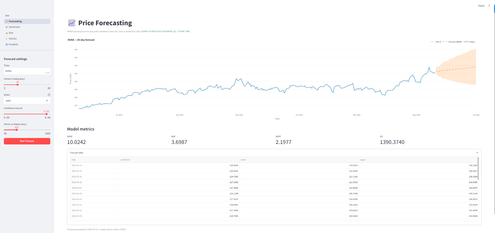
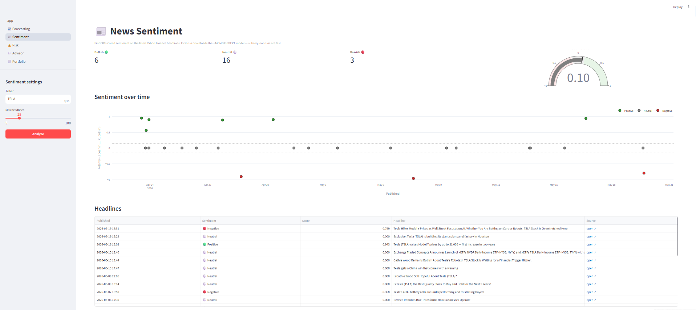
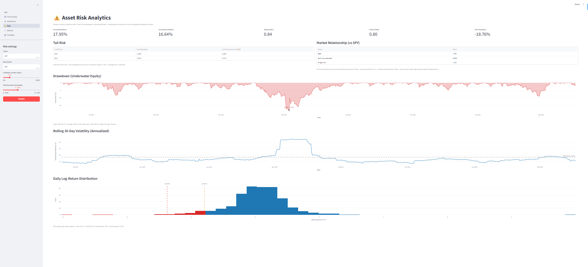
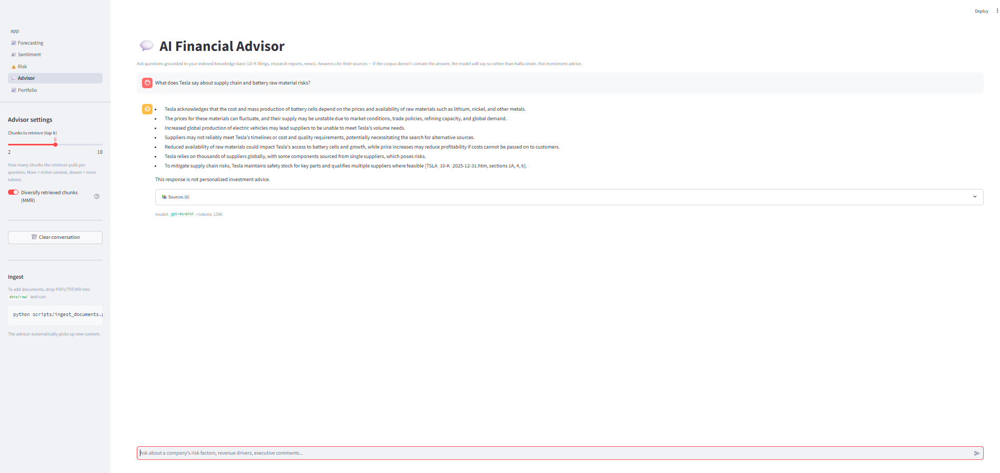
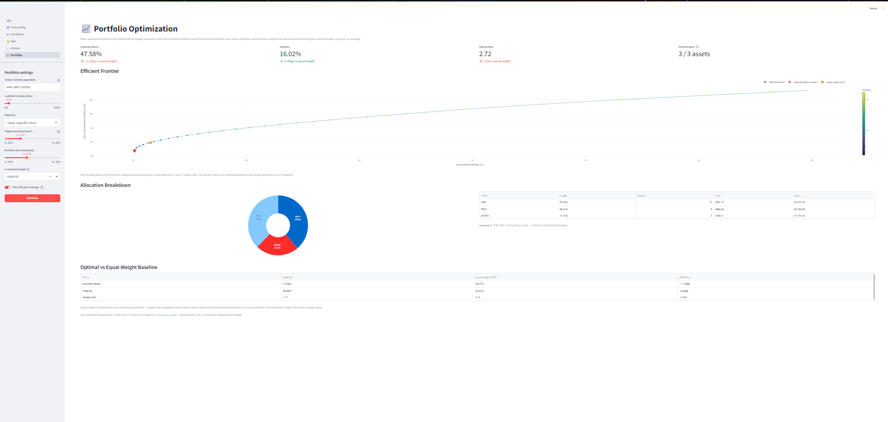
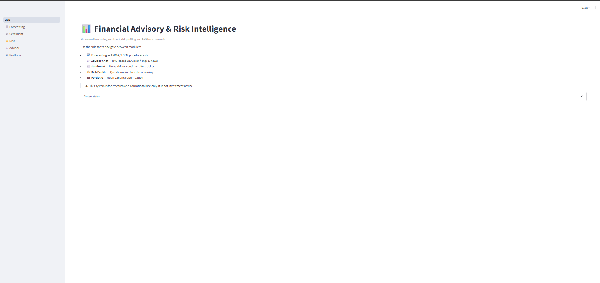
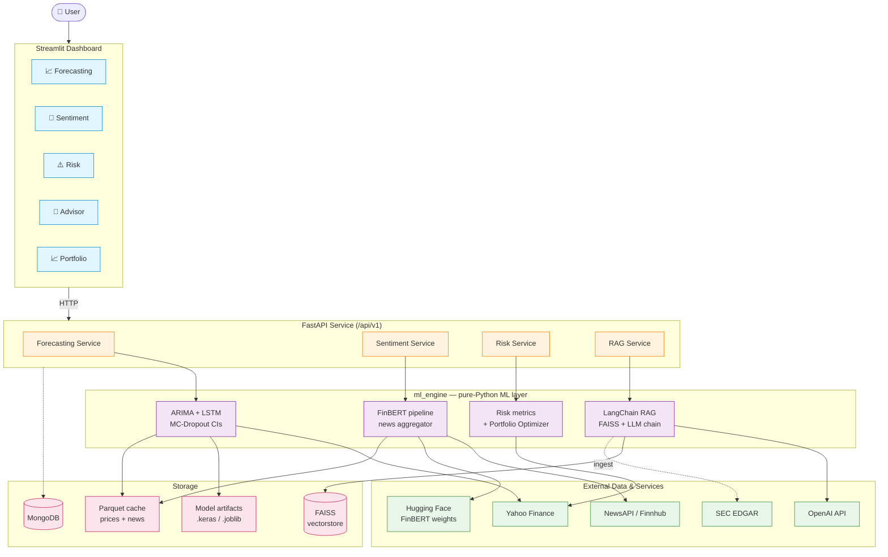

# AI-Powered Financial Advisory & Risk Intelligence System

> An end-to-end financial advisory platform combining time-series forecasting, NLP sentiment analysis, retrieval-augmented Q&A, asset risk analytics, and mean-variance portfolio optimization — exposed through a FastAPI service and a Streamlit dashboard.

[](https://www.python.org/downloads/)
[](LICENSE)
[](https://github.com/psf/black)
[](https://github.com/pre-commit/pre-commit)

---

## What It Does

This system is a working prototype of the analytical surface a retail-style financial advisor would use end-to-end. Given a ticker, it forecasts prices with two independent models, summarizes the news sentiment around the company, quantifies the asset's risk profile, and lets you ask grounded questions about its SEC filings. Given a basket of tickers and a dollar budget, it constructs an optimized portfolio with whole-share allocations and shows you the full efficient frontier.

Everything is exposed two ways: as a typed FastAPI service (OpenAPI docs at `/docs`) and as a five-page Streamlit dashboard.

It is explicitly **not** production investment advice. It is a faithful reconstruction of the techniques real quant and advisory shops use, built from first principles, with the math visible.

## Highlights

- **Two forecasters, one interface.** ARIMA for the cheap, well-understood baseline. LSTM with MC-Dropout for non-linear patterns and Bayesian-style uncertainty bands. Both implement the same `Forecaster` protocol and persist artifacts to disk.
- **Multi-source news with fallback.** NewsAPI → Finnhub → yfinance provider chain — fails individually, never collectively. Articles are scored by FinBERT (ProsusAI) for finance-tuned sentiment, with rolling daily aggregates.
- **Risk analytics on log returns.** Sharpe, Sortino, historical VaR/CVaR at 95/99%, underwater drawdown curves with peak/trough/recovery timing, market beta with Jensen's alpha and R², rolling 30-day vol, and a return-distribution histogram with VaR markers.
- **RAG advisor with citations.** FAISS vector store + OpenAI `text-embedding-3-small` + `gpt-4o-mini`. Supports both similarity and Maximum Marginal Relevance retrieval for diverse multi-document context. Every answer cites its source chunks with similarity scores.
- **Mean-variance portfolio optimization.** PyPortfolioOpt with Ledoit-Wolf shrinkage covariance. Max-Sharpe / min-volatility / target-return objectives. Efficient frontier sweep, LP-based whole-share discrete allocation, equal-weight baseline for comparison.
- **Security tooling.** Pre-commit hook with `detect-secrets` scanning every commit against a baseline. Eight hygiene hooks (whitespace, large files, merge conflicts, etc.) auto-fix on commit.

## Dashboard

<table>
  <tr>
    <td width="50%" valign="top">
      <br/>
      <sub><b>📈 Forecasting</b> — ARIMA + LSTM forecasts with MC-Dropout confidence bands.</sub>
    </td>
    <td width="50%" valign="top">
      <br/>
      <sub><b>📰 Sentiment</b> — FinBERT-scored headlines aggregated daily, with multi-source news fallback.</sub>
    </td>
  </tr>
  <tr>
    <td width="50%" valign="top">
      <br/>
      <sub><b>⚠️ Risk</b> — Sharpe / Sortino / VaR / CVaR / drawdown / beta vs SPY, with underwater curve and return histogram.</sub>
    </td>
    <td width="50%" valign="top">
      <br/>
      <sub><b>💬 Advisor</b> — RAG chat grounded in your indexed corpus (10-Ks, news), with source citations and MMR retrieval.</sub>
    </td>
  </tr>
  <tr>
    <td width="50%" valign="top">
      <br/>
      <sub><b>📈 Portfolio</b> — Mean-variance optimization with full efficient frontier, optimal-point marker, and whole-share allocation.</sub>
    </td>
    <td width="50%" valign="top">
      <br/>
      <sub><b>🏠 Home</b> — Landing page with system overview and navigation.</sub>
    </td>
  </tr>
</table>

## Architecture



Two architectural choices worth calling out:

`backend/` and `ml_engine/` are separate top-level packages. The backend imports from `ml_engine`, but `ml_engine` knows nothing about FastAPI. This lets the modeling layer be reused from notebooks, batch scripts, or another service without dragging in web dependencies.

The `services/` layer sits between route handlers and `ml_engine/`. Handlers stay thin (parse request → call service → return response). Services hold orchestration logic (caching, model selection, persistence, async dispatch of CPU-bound work via `asyncio.to_thread`). This is the seam most beginner projects skip and regret later.

## Features by Phase

The project shipped in seven sequenced phases. Each is tagged in the git history (`phase-0`, `phase-2a-arima`, …, `phase-6-rag`).

| Phase | Module | What landed |
|---|---|---|
| **0** | Foundation | FastAPI scaffold, MongoDB async client, Pydantic schemas, service interfaces, RAG plumbing, Streamlit shell |
| **2A** | ARIMA forecasting | `auto_arima` model selection, walk-forward backtest, artifact persistence, MAPE/RMSE evaluation |
| **2B** | LSTM forecasting | Stacked LSTM (64→32) with dropout, MC-Dropout vectorized over K paths for uncertainty bands |
| **3** | Sentiment | FinBERT pipeline (forced PyTorch backend for Keras 3 compatibility), multi-source news fetcher with provider fallback chain |
| **4** | Risk analytics | Sharpe / Sortino, historical VaR/CVaR, drawdown with timing, OLS beta/alpha vs benchmark, rolling vol, return histogram |
| **5** | Portfolio optimization | PyPortfolioOpt with Ledoit-Wolf, max-Sharpe / min-vol / efficient-return objectives, efficient frontier sweep, discrete allocation |
| **6** | RAG advisor | FAISS + OpenAI embeddings, LCEL chain, MMR retrieval toggle, source citations with similarity scores, SEC EDGAR ingestion via `data.sec.gov` API |

A pre-commit pipeline (`detect-secrets` + 7 hygiene hooks) runs on every commit, blocking accidental secret leaks before they reach the remote.

## Quickstart

Tested on Windows 11 (PowerShell), macOS, and Linux. Python 3.10+ required.

```bash
# 1. Clone and create the virtual environment
git clone https://github.com/<your-username>/financial-advisory-system.git
cd financial-advisory-system
python -m venv .venv
source .venv/bin/activate         # On Windows: .venv\Scripts\Activate.ps1

# 2. Install dependencies (~5 minutes; tensorflow + torch + transformers are large)
pip install -r requirements.txt

# 3. Configure environment
cp .env.example .env
# Edit .env and fill in: OPENAI_API_KEY (required for RAG),
# NEWS_API_KEY + FINNHUB_API_KEY (optional, for richer news),
# SEC_USER_AGENT (required for SEC filing downloads).

# 4. Start MongoDB (Docker is easiest)
docker compose up -d mongo

# 5. Start the backend (one terminal)
uvicorn backend.main:app --reload --port 8000
# OpenAPI docs: http://localhost:8000/docs

# 6. Start the dashboard (separate terminal)
streamlit run dashboard/app.py
# Dashboard: http://localhost:8501
```

### Loading the RAG knowledge base

The advisor page needs documents to ground its answers. Drop PDFs, 10-K HTML filings, or text files into `data/raw/` and run:

```bash
python scripts/ingest_documents.py data/raw/
```

For SEC filings specifically, use the included helper which bypasses the XBRL Viewer wrapper:

```bash
python scripts/fetch_sec_filing.py AAPL 10-K --out data/raw/
```

## Configuration

All settings live in `.env` (gitignored) and are loaded via Pydantic Settings. Key variables:

| Variable | Purpose | Required |
|---|---|---|
| `MONGODB_URI` | MongoDB connection string | Yes |
| `OPENAI_API_KEY` | RAG chain — embeddings + chat | RAG only |
| `OPENAI_CHAT_MODEL` | Chat model (default `gpt-4o-mini`) | No |
| `OPENAI_EMBEDDING_MODEL` | Embeddings (default `text-embedding-3-small`) | No |
| `NEWS_API_KEY` | NewsAPI.org for headline sentiment | Optional |
| `FINNHUB_API_KEY` | Finnhub fallback news source | Optional |
| `SEC_USER_AGENT` | Required by SEC API etiquette — `"Name email@example.com"` | SEC filings only |
| `RAG_CHUNK_SIZE` | Splitter chunk size in characters (default 1000) | No |
| `RAG_CHUNK_OVERLAP` | Splitter overlap (default 150) | No |
| `USE_LOCAL_EMBEDDINGS` | If `true`, fall back to `sentence-transformers/all-MiniLM-L6-v2` | No |
| `HF_HUB_OFFLINE` | Set to `1` after FinBERT is cached to skip network checks | No |

See `.env.example` for the full annotated set.

## Project Structure

```
financial-advisory-system/
├── backend/                  FastAPI service (API layer + orchestration)
│   ├── main.py               App entry, lifespan, middleware
│   ├── core/                 Settings, logging, exceptions, security
│   ├── db/                   MongoDB async client + repositories
│   ├── api/v1/endpoints/     Route handlers per module
│   ├── schemas/              Pydantic request/response contracts
│   └── services/             Business-logic orchestration
│
├── ml_engine/                Pure-Python ML/NLP layer (no FastAPI deps)
│   ├── forecasting/          ARIMA + LSTM behind a Forecaster protocol
│   ├── sentiment/            FinBERT pipeline + multi-source news fetcher
│   ├── risk/                 Sharpe, Sortino, VaR, drawdown, beta, profiler
│   ├── portfolio/            PyPortfolioOpt wrapper (Phase 5)
│   ├── rag/                  LangChain ingestion, FAISS, retriever, chain
│   ├── data/                 yfinance + multi-source news clients
│   └── utils/                Caching, metric helpers
│
├── dashboard/                Streamlit app (consumes the FastAPI service)
│   ├── app.py                Landing page
│   ├── pages/                One page per module (auto-discovered)
│   └── components/           API client, reusable widgets
│
├── scripts/                  CLI utilities
│   ├── ingest_documents.py   Load + chunk + embed PDFs/HTMLs into FAISS
│   ├── fetch_sec_filing.py   SEC EDGAR programmatic downloader
│   ├── train_forecaster.py   Train ARIMA/LSTM and persist artifacts
│   └── evaluate_models.py    Walk-forward eval for the Results section
│
├── tests/                    pytest mirroring src tree
├── notebooks/                EDA + modeling experiments (Jupyter)
├── docs/                     Roadmap, architecture notes
├── data/                     Raw + processed + cache + vectorstore (gitignored)
├── models/                   Trained model artifacts (gitignored)
├── .pre-commit-config.yaml   detect-secrets + hygiene hooks
├── .secrets.baseline         Known/whitelisted secret patterns
├── docker-compose.yml        Mongo + backend + dashboard stack
├── pyproject.toml            Ruff, Black, Mypy, Pytest config
└── requirements.txt          Pinned dependencies
```

## Tech Stack

| Layer | Tools |
|---|---|
| API | FastAPI · Pydantic v2 · Uvicorn · httpx |
| Data | yfinance · NewsAPI · Finnhub · SEC EDGAR · pandas · numpy |
| Forecasting | statsmodels (ARIMA/SARIMAX) · TensorFlow / Keras (LSTM with MC-Dropout) · scikit-learn |
| NLP | transformers (FinBERT — ProsusAI) · PyTorch · nltk |
| RAG / LLM | LangChain · FAISS · OpenAI · tiktoken · sentence-transformers |
| Optimization | PyPortfolioOpt · cvxpy |
| Storage | MongoDB (motor async) · parquet · FAISS index |
| Dashboard | Streamlit · Plotly · altair |
| Quality | Ruff · Black · Mypy · pytest + pytest-asyncio + pytest-cov |
| Security | pre-commit · detect-secrets |
| Observability | loguru · request-id middleware |

## Results

All numbers below are produced by `scripts/evaluate_models.py`. Re-run with `python scripts/evaluate_models.py --output docs/eval_results.md` to refresh on current data.

_Generated 2026-05-21 on tickers `AAPL, MSFT, GOOGL`._

### Forecasting Accuracy (30-day walk-forward holdout)

| Ticker | Model | RMSE ($) | MAPE | Train size | Runtime |
|---|---|---:|---:|---:|---:|
| AAPL | ARIMA(5,1,0) | 24.73 | 7.03% | 471 | 2.1s |
| AAPL | LSTM(64,32) + MC-Dropout | 36.20 | 11.20% | 471 | 32.5s |
| MSFT | ARIMA(5,1,0) | 41.42 | 9.34% | 221 | 0.1s |
| MSFT | LSTM(64,32) + MC-Dropout | 32.85 | 7.39% | 221 | 14.1s |
| GOOGL | ARIMA(5,1,0) | 49.58 | 10.65% | 221 | 0.1s |
| GOOGL | LSTM(64,32) + MC-Dropout | 72.92 | 17.80% | 221 | 14.1s |

Methodology: trained on history up to T-30, forecasted the next 30 trading days, scored against actuals.

**Reading the table.** ARIMA wins on 2 of 3 tickers (AAPL and GOOGL). LSTM beats ARIMA on MSFT, where the price series happened to have non-linear structure the recurrent net could exploit. This is consistent with a recurring finding in time-series literature — neural forecasters don't reliably beat well-tuned statistical baselines on noisy financial data, even though they're substantially more expensive to train. Keeping both models alive is the right call: they complement each other, and the `Forecaster` abstraction means the dashboard can serve whichever is performing better per ticker.

### Portfolio Backtest (out-of-sample, last 30% of window)

| Strategy | Realized Return (ann.) | Realized Vol (ann.) | Sharpe | $10k → |
|---|---:|---:|---:|---:|
| Max-Sharpe portfolio | 41.49% | 31.00% | 1.27 | $11,314 |
| Equal-weight (1/N) | 26.38% | 19.70% | 1.24 | $10,817 |
| SPY buy-and-hold | 22.13% | 14.63% | 1.38 | $10,681 |

Max-Sharpe weights fitted on the first 70% of the price history; all three strategies evaluated on the held-out 30%. Risk-free rate = 2%.

**Reading the table.** Max-Sharpe earned the highest absolute return ($11,314 vs $10,681) but at much higher volatility, and on a risk-adjusted basis it essentially tied equal-weight and was *beaten* by SPY. This is the famous **estimation-error problem** in mean-variance optimization showing up exactly as expected: the optimizer concentrates in whichever assets had the best in-sample Sharpe, and the future doesn't oblige. SPY's higher realized Sharpe is no accident either — diversification across 500 names is a structural advantage no 3-ticker portfolio can match. The optimization framework is correct; what's misleading is the inputs (`mean_historical_return` is a notoriously bad expected-returns estimator). This is precisely why the "Future Work" section calls out Black-Litterman.

### Sentiment Signal

FinBERT daily-aggregated sentiment vs next-day log returns over the last 30 days:

- **AAPL**: 50 headlines, corr(sentiment, next-day return) = `−0.042`
- **MSFT**: 50 headlines, corr(sentiment, next-day return) = `+0.470`
- **GOOGL**: 45 headlines, corr(sentiment, next-day return) = `−0.334`

**Reading the numbers.** AAPL sits near zero (no detectable linear relationship). MSFT shows a strong positive correlation — the kind of result that would be tradeable if it held up out-of-sample, which on n≈30 days it almost certainly doesn't. GOOGL is moderately negative, suggesting a contrarian or news-overreaction dynamic. The takeaway is the meta-point, not the specific numbers: news sentiment alone is a noisy weak signal, and any real strategy would combine it with technicals, fundamentals, and order-flow data before betting on it.

## Development

```bash
# Run tests
pytest

# Lint + format
ruff check .
black .
mypy backend ml_engine

# First-time pre-commit setup
pip install pre-commit detect-secrets
pre-commit install
detect-secrets scan > .secrets.baseline    # only if .secrets.baseline is missing

# Manual pre-commit run over the whole repo
pre-commit run --all-files
```

Pre-commit will scan every diff against `.secrets.baseline` and block the commit if it finds high-entropy strings not on the whitelist. Eight hygiene hooks also auto-fix trailing whitespace, missing final newlines, etc.

## Future Work

If this project were to continue, the natural next steps are:

- **Multi-turn RAG memory.** The advisor chain is currently single-turn. Extend with `ConversationBufferMemory` + query reformulation so follow-ups like "what about for Microsoft instead?" reuse the prior context.
- **User accounts & saved portfolios.** The auth scaffolding (`passlib`, `python-jose`) is in `requirements.txt` but unused. Add JWT login and persist each user's optimized portfolios.
- **Cross-module advisor summary endpoint.** Combine forecast + sentiment + risk-adjusted allocation into one response for a watchlist.
- **Production deployment.** Containerize end-to-end via the existing `docker-compose.yml`, push to Render / Fly.io / Railway for a live URL.
- **Forecast model registry.** Track training date + holdout metrics per ticker; auto-select the better-performing model.
- **Black-Litterman expected returns.** The current `mean_historical_return` estimator is naive — Black-Litterman blends market-equilibrium priors with explicit views for much more stable forecasts.

## License

MIT — see [LICENSE](LICENSE).

## Acknowledgements

Built as a Master's portfolio project. Particularly indebted to: the PyPortfolioOpt and LangChain maintainers; the ProsusAI team for the FinBERT weights; Yahoo Finance, NewsAPI, Finnhub, and the SEC for the free data tier that makes prototypes like this possible.

---

*This is a portfolio / educational project. None of its output constitutes investment advice. Past performance does not predict future results.*
